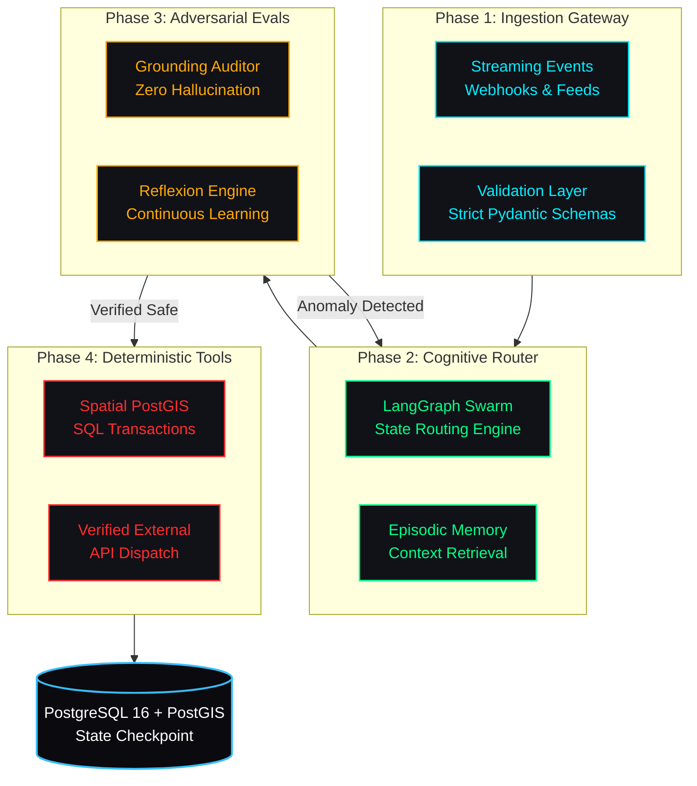

# ALI ABDULLAH
### Autonomous Systems & Forward Deployed AI Engineer

 

 

  <b>Architecting deterministic multi-agent swarms, verification harnesses, and production-grade data systems.</b> 
  Bridging unstructured foundation models with relational, spatial, and mission-critical execution.

---

## Core Engineering Tenets

Every system I architect and deploy adheres to three foundational axioms:

### `01 //` Deterministic Actuation over Stochastic Guesswork
> **Axiom**: Autonomous agents cannot rely on loose prompt heuristics in production. Every model output is constrained by validated Pydantic schemas, bounded DAG execution graphs, and strict transaction rollback budgets.

### `02 //` Evaluation-Driven Reliability (Evals First)
> **Axiom**: Inference without automated verification is enterprise risk. Workflows incorporate programmatic grounding auditors, hallucination detection, and real-time latency telemetry before committing state changes.

### `03 //` Enterprise-Grade Latency & State Management
> **Axiom**: Foundation models are only as capable as their underlying data layer. I design asynchronous pipelines using PostgreSQL, PostGIS, TimescaleDB, and AsyncIO to achieve sub-second operational throughput.

---

## Autonomous Agent Systems Blueprint

Below is the production-grade architectural lifecycle implemented across my multi-agent platforms:

---

## Technical Stack & Production Arsenal

<table>
  <thead>
    <tr>
      <th width="30%">Domain</th>
      <th width="70%">Technologies & Frameworks</th>
    </tr>
  </thead>
  <tbody>
    <tr>
      <td><b>Agentic & AI Engines</b></td>
      <td>
        <code>LangGraph</code> &bull; <code>LangChain</code> &bull; <code>Google GenAI SDK</code> &bull; <code>PydanticAI</code> &bull; <code>FastEmbed</code> &bull; <code>OpenAI API</code> &bull; <code>Model Evals</code>
      </td>
    </tr>
    <tr>
      <td><b>Runtime & Systems</b></td>
      <td>
        <code>Python 3.12+</code> &bull; <code>TypeScript</code> &bull; <code>FastAPI</code> &bull; <code>Node.js</code> &bull; <code>AsyncIO</code> &bull; <code>Uvicorn</code> &bull; <code>Next.js 15</code>
      </td>
    </tr>
    <tr>
      <td><b>Data & Spatial Engines</b></td>
      <td>
        <code>PostgreSQL 16</code> &bull; <code>PostGIS 3.4+</code> &bull; <code>TimescaleDB</code> &bull; <code>GeoAlchemy2</code> &bull; <code>Redis</code> &bull; <code>SQLAlchemy Async</code>
      </td>
    </tr>
    <tr>
      <td><b>DevSecOps & Reliability</b></td>
      <td>
        <code>Docker</code> &bull; <code>GitHub Actions CI/CD</code> &bull; <code>Linux</code> &bull; <code>SLSA Provenance</code> &bull; <code>CodeQL</code> &bull; <code>Dependabot</code>
      </td>
    </tr>
  </tbody>
</table>

---

## Featured Production Engineering

### [n8n-nodes-jev-ai](https://github.com/Venomous-101/n8n-nodes-jev-ai)
*Production-grade enterprise integration node published on npm registry with SLSA provenance.*

- **Type**: TypeScript enterprise node for n8n workflow automation instances.
- **Security**: Hardened against prototype pollution, SSRF, and unvalidated payloads with verified SLSA build provenance.
- **Verification**: Complete test matrix, custom community node documentation, and full video demonstration.
- **Registry**: Published as [`n8n-nodes-jev-ai`](https://www.npmjs.com/package/n8n-nodes-jev-ai) on npm.

---

## GitHub Performance Telemetry

  

 

  
  

---

## Systems Architecture Deep Dive

<b>CLICK TO EXPAND: Mission-Critical Agent Design Standards</b>

 

### 1. Bounded Execution Graphs
Every agent runs inside a strictly cyclic-bounded Directed Acyclic Graph (DAG) using LangGraph. If an agent loops more than 5 iterations without convergence, an automated circuit breaker trips and routes the payload to human oversight or fallback heuristics.

### 2. PostGIS Spatial Grounding
Unlike simple RAG vector search, geospatial and logistical tasks require hard spatial constraints. I integrate PostGIS geography primitives (`ST_DWithin`, `ST_Contains`) directly into tool calls, enabling agents to compute physical hazard perimeters without coordinate hallucinations.

### 3. Automated Reflexion Loops
Completed operational runs are audited against ground-truth outcomes. Extracted lessons are stored in an episodic memory table and dynamically injected as few-shot exemplars into future swarm tasks.

---

## Direct Transmission / Comms

I actively collaborate with forward-thinking engineering teams building autonomous systems, defense technologies, and high-stakes data intelligence platforms.

- **LinkedIn**: [linkedin.com/in/ali-abdullah-a42a08319](https://www.linkedin.com/in/ali-abdullah-a42a08319)
- **Direct Email**: [aliabdullah0k09@gmail.com](mailto:aliabdullah0k09@gmail.com)
- **Operating Timezones**: PKT (UTC+5) | Available for US, EU, and APAC remote engineering teams

  Engineered with precision by Ali Abdullah &bull; Terminal Online

