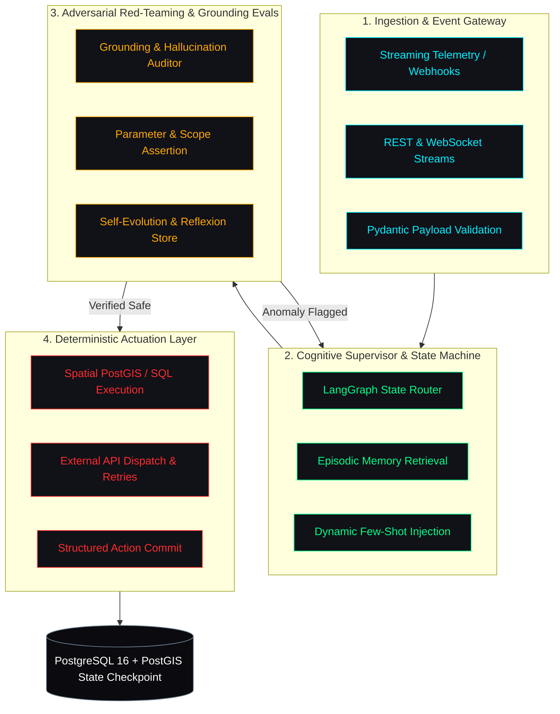

# ALI ABDULLAH
### Autonomous Systems & Forward Deployed AI Engineer

  <b>Designing deterministic multi-agent swarms, verification harnesses, and production-grade data systems.</b> 
  Bridging unstructured foundation models with relational, spatial, and mission-critical execution.

---

## Core Engineering Tenets

Three principles govern every architecture I design and deploy:

1. **Deterministic Actuation over Stochastic Guesswork**
   Autonomous agents cannot rely on loose prompt engineering in production. Every agentic output is enforced via validated Pydantic schemas, bounded execution graphs, and strict transaction rollback budgets.

2. **Evaluation-Driven Reliability (Evals First)**
   Inference without verification is technical debt. Workflows incorporate automated grounding checkers, hallucination detection, and real-time latency telemetry before committing changes to state.

3. **Enterprise-Grade Latency & State Management**
   Foundation models are only as effective as the underlying data layer. I design asynchronous pipelines using PostgreSQL, PostGIS, TimescaleDB, and AsyncIO to achieve sub-second operational throughput.

---

## Autonomous Agent Systems Blueprint

Below is the standard architectural lifecycle I implement for mission-critical multi-agent systems:

---

## Technical Stack & Production Arsenal

<table>
  <tr>
    <td width="25%" valign="top"><b>Agentic & AI Engines</b></td>
    <td width="75%">
      <code>LangGraph</code> &bull; <code>LangChain</code> &bull; <code>Google GenAI SDK</code> &bull; <code>PydanticAI</code> &bull; <code>FastEmbed</code> &bull; <code>OpenAI API</code> &bull; <code>Model Evals</code>
    </td>
  </tr>
  <tr>
    <td width="25%" valign="top"><b>Runtime & Backends</b></td>
    <td width="75%">
      <code>Python </code> &bull; <code>TypeScript</code> &bull; <code>FastAPI</code> &bull; <code>Node.js</code> &bull; <code>AsyncIO</code> &bull; <code>Uvicorn</code> &bull; <code>Next.js 15</code>
    </td>
  </tr>
  <tr>
    <td width="25%" valign="top"><b>Data & Spatial Engines</b></td>
    <td width="75%">
      <code>PostgreSQL 16</code> &bull; <code>PostGIS 3.4+</code> &bull; <code>TimescaleDB</code> &bull; <code>GeoAlchemy2</code> &bull; <code>Redis</code> &bull; <code>SQLAlchemy Async</code>
    </td>
  </tr>
  <tr>
    <td width="25%" valign="top"><b>DevSecOps & Reliability</b></td>
    <td width="75%">
      <code>Docker</code> &bull; <code>GitHub Actions CI/CD</code> &bull; <code>Linux</code> &bull; <code>SLSA Provenance</code> &bull; <code>CodeQL</code> &bull; <code>Dependabot</code>
    </td>
  </tr>
</table>

---

## Featured Production Engineering

### [n8n-nodes-jev-ai](https://github.com/Venomous-101/n8n-nodes-jev-ai)
*Production-grade enterprise integration node published on npm registry with SLSA provenance.*

- **Type**: TypeScript enterprise node for n8n automation instances.
- **Security**: Hardened against prototype pollution, SSRF, and unvalidated payloads with verified SLSA build provenance.
- **Verification**: Complete test matrix, custom community node documentation, and full video demonstration.
- **Registry**: Published as [`n8n-nodes-jev-ai`](https://www.npmjs.com/package/n8n-nodes-jev-ai) on npm.

---

## GitHub Performance Telemetry

  
  

---

## Direct Transmission / Comms

I actively collaborate with forward-thinking engineering teams building autonomous systems, defense technologies, and high-stakes data intelligence platforms.

- **LinkedIn**: [linkedin.com/in/ali-abdullah-a42a08319](https://www.linkedin.com/in/ali-abdullah-a42a08319)
- **Direct Email**: [aliabdullah0k09@gmail.com](mailto:aliabdullah0k09@gmail.com)
- **Operating Timezones**: PKT (UTC+5) | Available for US, EU, and APAC remote engineering teams

  Engineered with precision by Ali Abdullah &bull; Terminal Online

